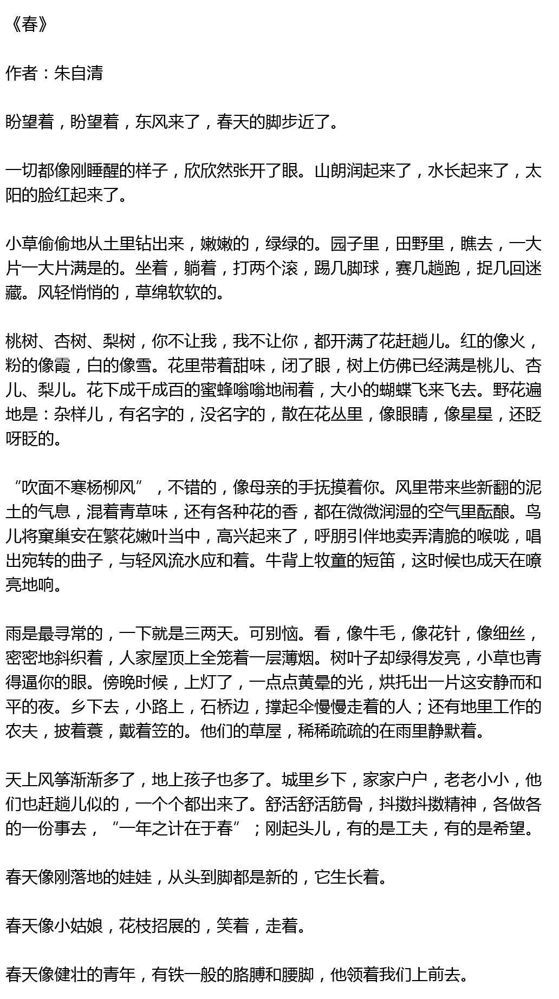

# Timg: Text to Image in Golang

## Example

```go
package main

import (
	"github.com/bytepowered/timg"
	"image/jpeg"
	"os"
)

func main() {
	c, err := timg.NewDefaultCanvas()
	if err != nil {
		panic(err)
	}
	var str = `《春》

作者：朱自清

盼望着，盼望着，东风来了，春天的脚步近了。

一切都像刚睡醒的样子，欣欣然张开了眼。山朗润起来了，水长起来了，太阳的脸红起来了。

小草偷偷地从土里钻出来，嫩嫩的，绿绿的。园子里，田野里，瞧去，一大片一大片满是的。坐着，躺着，打两个滚，踢几脚球，赛几趟跑，捉几回迷藏。风轻悄悄的，草绵软软的。

桃树、杏树、梨树，你不让我，我不让你，都开满了花赶趟儿。红的像火，粉的像霞，白的像雪。花里带着甜味，闭了眼，树上仿佛已经满是桃儿、杏儿、梨儿。花下成千成百的蜜蜂嗡嗡地闹着，大小的蝴蝶飞来飞去。野花遍地是：杂样儿，有名字的，没名字的，散在花丛里，像眼睛，像星星，还眨呀眨的。

“吹面不寒杨柳风”，不错的，像母亲的手抚摸着你。风里带来些新翻的泥土的气息，混着青草味，还有各种花的香，都在微微润湿的空气里酝酿。鸟儿将窠巢安在繁花嫩叶当中，高兴起来了，呼朋引伴地卖弄清脆的喉咙，唱出宛转的曲子，与轻风流水应和着。牛背上牧童的短笛，这时候也成天在嘹亮地响。

雨是最寻常的，一下就是三两天。可别恼。看，像牛毛，像花针，像细丝，密密地斜织着，人家屋顶上全笼着一层薄烟。树叶子却绿得发亮，小草也青得逼你的眼。傍晚时候，上灯了，一点点黄晕的光，烘托出一片这安静而和平的夜。乡下去，小路上，石桥边，撑起伞慢慢走着的人;还有地里工作的农夫，披着蓑，戴着笠的。他们的草屋，稀稀疏疏的在雨里静默着。

天上风筝渐渐多了，地上孩子也多了。城里乡下，家家户户，老老小小，他们也赶趟儿似的，一个个都出来了。舒活舒活筋骨，抖擞抖擞精神，各做各的一份事去，“一年之计在于春”;刚起头儿，有的是工夫，有的是希望。

春天像刚落地的娃娃，从头到脚都是新的，它生长着。

春天像小姑娘，花枝招展的，笑着，走着。

春天像健壮的青年，有铁一般的胳膊和腰脚，他领着我们上前去。

赏析：

《春》是朱自清散文中的名篇佳作，但在作者生前，它却没有收入朱先生的散文集中。据陈杰同志考证，《春》最早发表在朱文叔编的《初中国文读本》第一册上。该书1933年7月由上海中华书局印行。陈说：“在篇名的右上角都注有标记。编者在课文目录后附注，凡有此标记者‘系特约撰述之作品’，可见是《读本》的编者当时特约朱先生等撰写给中学生阅读的文章。”(《关于〈春〉的出处》，《临沂师专学报》1983年第2期)《春》不仅在解放前被编入中学语文教材，1981年人民教育出版社中学语文编辑室编的《语文》第一册，也收录了它。但是，后者嫌原作有的词汇“陈旧”，有的语句不够“规范化”，因之对其进行了“加工润色”。这样，在文字上便与原作有了出入。为尊重朱自清作品的原貌，本篇赏析的对象是朱先生写定的未经修改的文字。`
	c.DrawText(timg.FontOptionDefault, str)
	file, err := os.Create("example.jpeg")
	if err != nil {
		panic(err)
	}
	defer file.Close()
	_ = jpeg.Encode(file, c.Canvas(), &jpeg.Options{Quality: 80})
}

```

## Output image



## Font Resource

default font: ./resources/msyh.ttf
